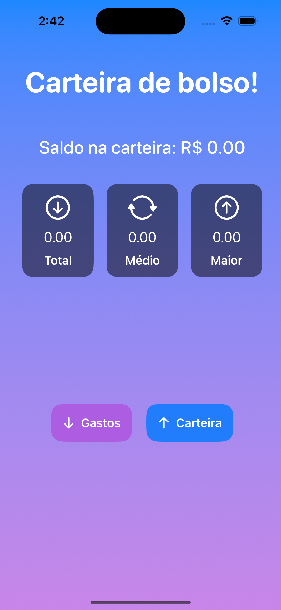
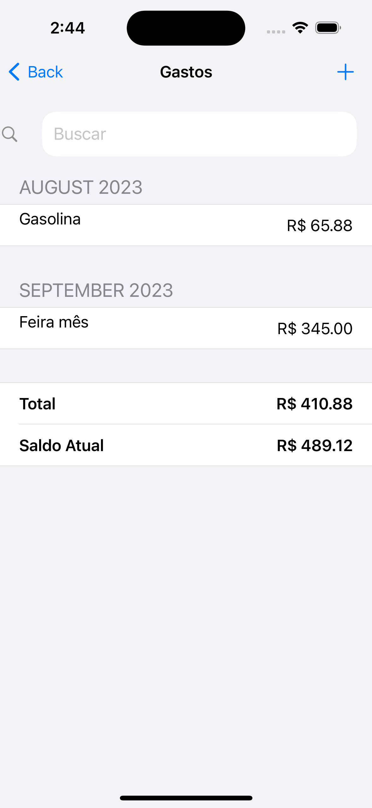
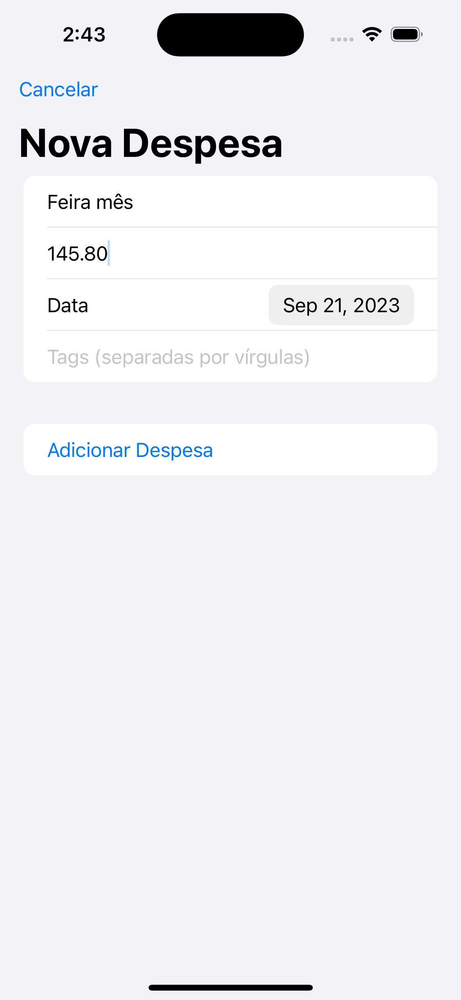
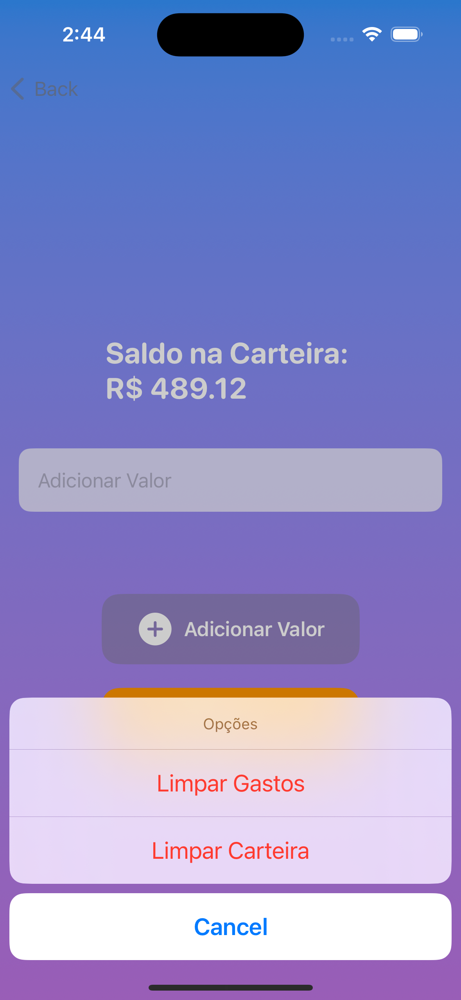

# Wallet

Uma aplicação iOS simples para gerenciar seus gastos diários.

## Descrição

O "Wallet" permite que você monitore seus gastos e mantenha um registro de suas transações diárias. Com uma interface amigável, você pode facilmente adicionar, editar ou remover gastos, bem como visualizar seu saldo atual.

## Screenshots

|  |    |
|:---------------------------:|:-----------------------------:|
| **Tela Principal**          | **Tela Inicial**              |
||     |
| **Adicionar Gasto**         | **Editar Gasto**              |
|       |           |
| **Exportar**                | **Opções**                    |

## Características

- Adicione gastos com nome, valor, data e tags.
- Edite ou remova gastos conforme necessário.
- Visualize um resumo dos seus gastos mensais.
- Interface intuitiva e fácil de usar.

## Como Usar

1. Na tela principal, você verá seu saldo atual.
2. Use o botão "+" para adicionar um novo gasto.
3. Deslize para a esquerda em um gasto para editar ou remover.
4. Use a barra de pesquisa para filtrar gastos por nome ou tag.

## Requisitos

- iOS 15.0 ou superior
- Xcode 13.0 ou superior

## Futuras Atualizações

- [ ] Sincronização com a nuvem.
- [ ] Categorias para gastos.
- [ ] Gráficos e análises de gastos.

## Contribuições

Contribuições são bem-vindas! Por favor, leia o arquivo [CONTRIBUTING.md](CONTRIBUTING.md) para detalhes sobre como contribuir para este projeto.

## Licença

Este projeto está licenciado sob a licença MIT. Para mais detalhes, consulte o arquivo [LICENSE.md](LICENSE.md).
